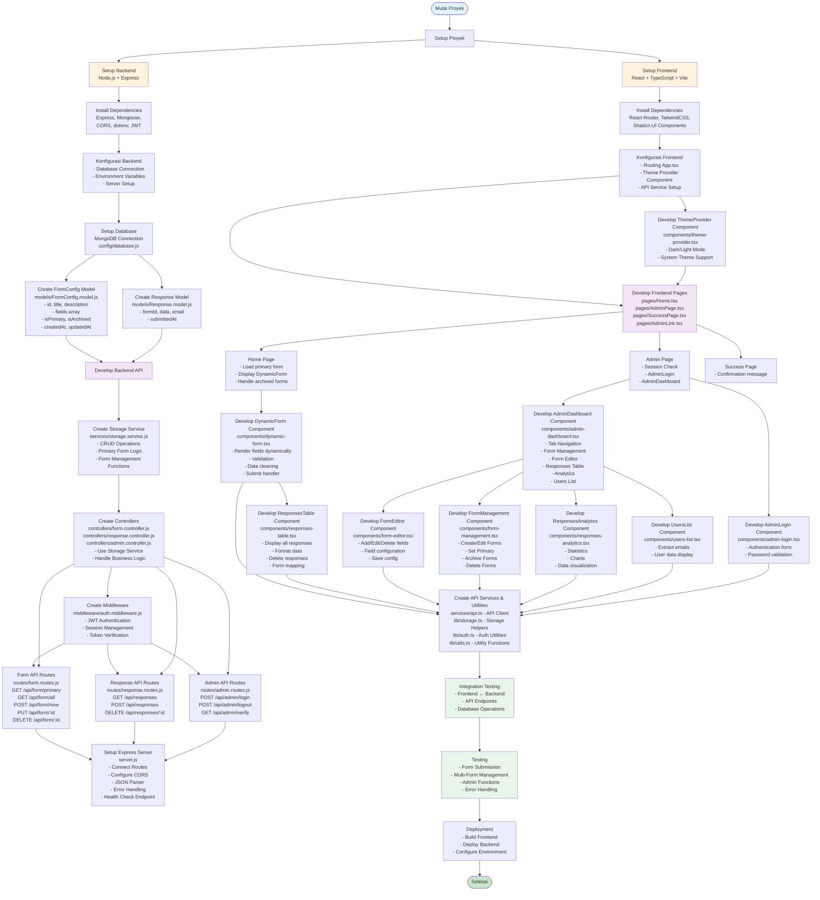
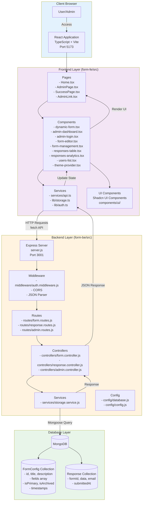
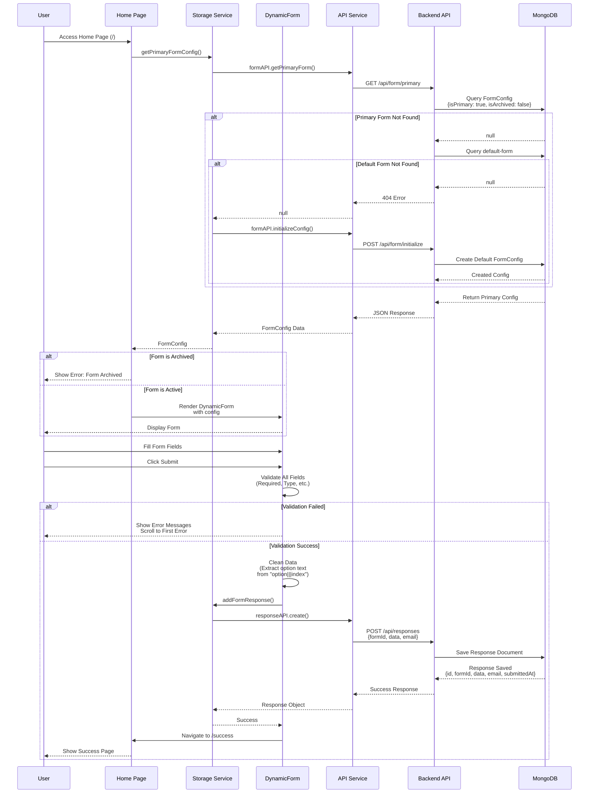
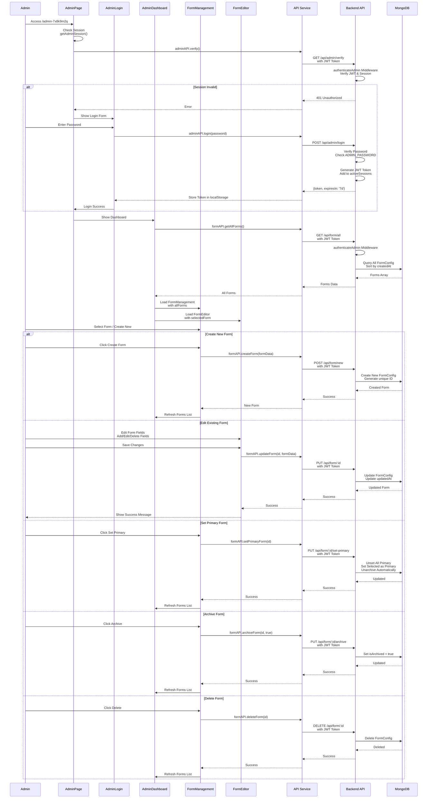
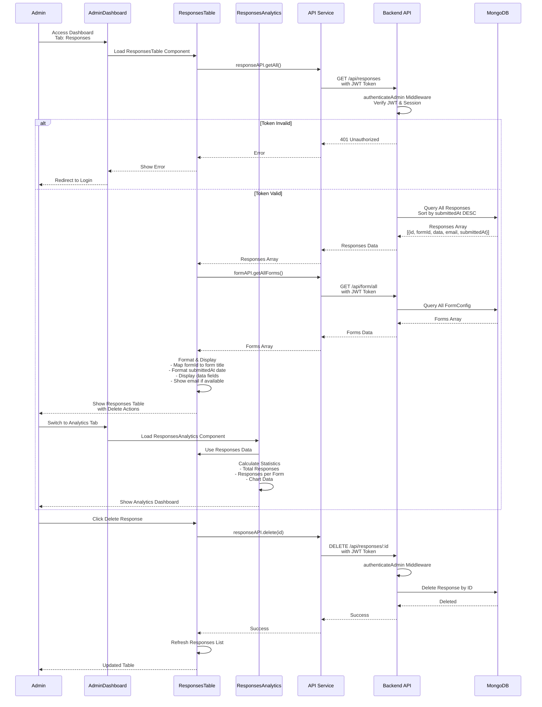
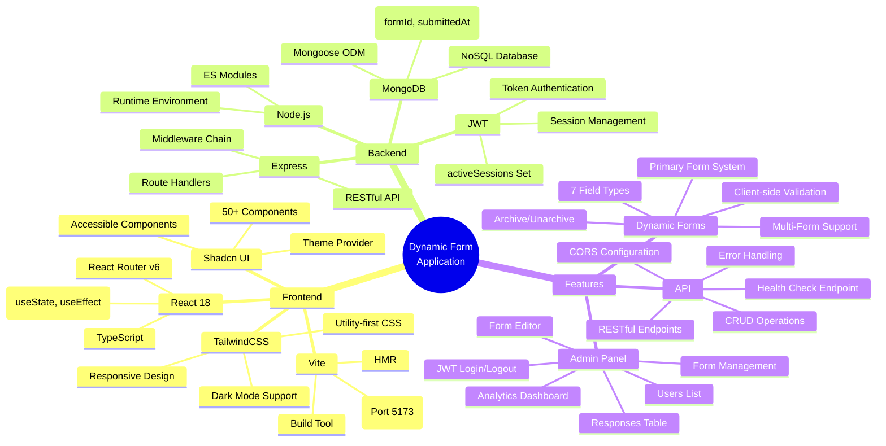

# Flowchart Alur Pembuatan Dynamic Form Application

## 1. Flowchart Proses Pengembangan



## 2. Flowchart Arsitektur Sistem



## 3. Flowchart Alur User - Form Submission



## 4. Flowchart Alur Admin - Form Management



## 5. Flowchart Alur Admin - View Responses



## 6. Flowchart Struktur Data Flow

```mermaid
flowchart LR
    subgraph Input["Input Data"]
        FormFields[Form Fields<br/>- text, email, number<br/>- textarea, select<br/>- checkbox, radio]
        FormConfigInput[Form Config Input<br/>Admin creates/edits<br/>form structure]
    end
    
    subgraph Processing["Processing"]
        Validation[Field Validation<br/>- Required check<br/>- Type validation<br/>- Error handling<br/>- Scroll to first error]
        DataCleaning[Data Cleaning<br/>- Extract option text<br/>from "option|||index"<br/>- Format arrays<br/>- Normalize values]
        FormProcessing[Form Processing<br/>- Generate unique IDs<br/>- Set primary flag<br/>- Archive/unarchive<br/>- Timestamp updates]
    end
    
    subgraph Storage["Storage (MongoDB)"]
        FormConfig[(FormConfig Collection<br/>- id (unique)<br/>- title, description<br/>- fields array<br/>- isPrimary (boolean)<br/>- isArchived (boolean)<br/>- createdAt, updatedAt)]
        Response[(Response Collection<br/>- _id (MongoDB)<br/>- formId (indexed)<br/>- data (Mixed type)<br/>- email (optional)<br/>- submittedAt (indexed))]
    end
    
    subgraph Output["Output"]
        SuccessPage[Success Page<br/>Confirmation message]
        ResponsesTable[Responses Table<br/>Admin View<br/>- All responses<br/>- Form mapping<br/>- Delete actions]
        Analytics[Analytics Dashboard<br/>- Total responses<br/>- Per form stats<br/>- Charts]
        UsersList[Users List<br/>- Email extraction<br/>- User data]
    end
    
    FormFields --> Validation
    Validation -->|Valid| DataCleaning
    Validation -->|Invalid| FormFields
    DataCleaning --> Response
    FormConfigInput --> FormProcessing
    FormProcessing --> FormConfig
    FormConfig --> FormFields
    Response --> SuccessPage
    Response --> ResponsesTable
    Response --> Analytics
    Response --> UsersList
    
    style Input fill:#e3f2fd
    style Processing fill:#fff3e0
    style Storage fill:#e8f5e9
    style Output fill:#f3e5f5
```

## 7. Flowchart Struktur Folder & File

```mermaid
flowchart TD
    Root[dynamic-form-application/] --> FE[form-fe/]
    Root --> BE[form-be/]
    Root --> Docs[FLOWCHART.md<br/>README.md]
    
    FE --> FESrc[src/]
    FE --> FEPublic[public/]
    FE --> FEConfig[tsconfig.json<br/>vite.config.ts<br/>package.json]
    
    FESrc --> FEPages[pages/<br/>- Home.tsx<br/>- AdminPage.tsx<br/>- AdminLink.tsx<br/>- SuccessPage.tsx]
    FESrc --> FEComponents[components/<br/>- dynamic-form.tsx<br/>- admin-dashboard.tsx<br/>- admin-login.tsx<br/>- form-editor.tsx<br/>- form-management.tsx<br/>- responses-table.tsx<br/>- responses-analytics.tsx<br/>- users-list.tsx<br/>- theme-provider.tsx<br/>- ui/ (Shadcn components)]
    FESrc --> FEServices[services/<br/>- api.ts]
    FESrc --> FELib[lib/<br/>- storage.ts<br/>- auth.ts<br/>- utils.ts]
    FESrc --> FEHooks[hooks/<br/>- use-mobile.ts<br/>- use-toast.ts]
    FESrc --> FEApp[App.tsx<br/>main.tsx<br/>index.css]
    
    BE --> BESrc[src/]
    BE --> BEScripts[scripts/<br/>- generate-jwt-secret.js]
    BE --> BEConfig[package.json<br/>README.md]
    
    BESrc --> BEServer[server.js]
    BESrc --> BERoutes[routes/<br/>- form.routes.js<br/>- response.routes.js<br/>- admin.routes.js]
    BESrc --> BEControllers[controllers/<br/>- form.controller.js<br/>- response.controller.js<br/>- admin.controller.js]
    BESrc --> BEModels[models/<br/>- FormConfig.model.js<br/>- Response.model.js]
    BESrc --> BEMiddleware[middleware/<br/>- auth.middleware.js]
    BESrc --> BEServices[services/<br/>- storage.service.js]
    BESrc --> BEConfigDir[config/<br/>- database.js<br/>- config.js]
    
    style Root fill:#e1f5ff
    style FE fill:#f3e5f5
    style BE fill:#fff3e0
    style FESrc fill:#e8f5e9
    style BESrc fill:#e8f5e9
```

## 8. Flowchart Teknologi Stack



## 9. Flowchart API Endpoints

```mermaid
flowchart TB
    subgraph Public["Public Endpoints"]
        P1[GET /api/form/primary<br/>Get primary form config]
        P2[GET /api/form<br/>Get form config<br/>(backward compatibility)]
        P3[POST /api/form/initialize<br/>Initialize default form]
        P4[POST /api/responses<br/>Submit form response]
        P5[GET /api/health<br/>Health check]
    end
    
    subgraph Admin["Admin Endpoints (JWT Required)"]
        A1[GET /api/form/all<br/>Get all forms]
        A2[GET /api/form/:id<br/>Get form by ID]
        A3[POST /api/form/new<br/>Create new form]
        A4[PUT /api/form<br/>Update form<br/>(backward compatibility)]
        A5[PUT /api/form/:id<br/>Update form by ID]
        A6[PUT /api/form/:id/set-primary<br/>Set form as primary]
        A7[PUT /api/form/:id/archive<br/>Archive form]
        A8[DELETE /api/form/:id<br/>Delete form]
        A9[GET /api/responses<br/>Get all responses]
        A10[GET /api/responses/:id<br/>Get response by ID]
        A11[DELETE /api/responses/:id<br/>Delete response]
        A12[POST /api/admin/login<br/>Admin login]
        A13[POST /api/admin/logout<br/>Admin logout]
        A14[GET /api/admin/verify<br/>Verify session]
    end
    
    style Public fill:#e8f5e9
    style Admin fill:#fff3e0
```

## Penjelasan Singkat

### Struktur Proyek:

1. **Frontend (form-fe/)**: 
   - React + TypeScript + Vite
   - Pages: Home, AdminPage, SuccessPage, AdminLink
   - Components: DynamicForm, AdminDashboard, FormEditor, FormManagement, ResponsesTable, ResponsesAnalytics, UsersList
   - Services: API client, storage utilities, auth utilities
   - UI: Shadcn UI components dengan theme support

2. **Backend (form-be/)**:
   - Node.js + Express
   - Routes: form.routes.js, response.routes.js, admin.routes.js
   - Controllers: form.controller.js, response.controller.js, admin.controller.js
   - Models: FormConfig.model.js, Response.model.js
   - Services: storage.service.js (MongoDB operations)
   - Middleware: auth.middleware.js (JWT authentication)
   - Config: database.js, config.js

### Fitur Utama:

- **Multi-Form Support**: Sistem dapat mengelola multiple forms dengan primary form system
- **Dynamic Form**: Form yang dapat dikonfigurasi dengan 7 tipe field (text, email, number, textarea, select, checkbox, radio)
- **Form Management**: Admin dapat create, edit, delete, set primary, dan archive forms
- **Admin Panel**: Dashboard lengkap dengan form management, responses table, analytics, dan users list
- **Authentication**: JWT-based authentication dengan session management menggunakan activeSessions Set
- **Data Cleaning**: Automatic cleaning untuk extract option text dari format "option|||index"
- **Archive System**: Forms dapat di-archive dan tidak akan ditampilkan di home page
- **Responsive Design**: UI yang responsif dengan TailwindCSS dan dark mode support
- **Error Handling**: Comprehensive error handling di frontend dan backend

### Alur Data:

1. **User Flow**: Home → Load Primary Form → Fill Form → Validate → Clean Data → Submit → Success Page
2. **Admin Flow**: AdminPage → Login → Dashboard → Manage Forms/View Responses → Logout
3. **Form Management**: Create/Edit Forms → Set Primary → Archive/Delete → Update affects home page immediately
4. **Response Management**: View All Responses → Filter by Form → Delete Responses → View Analytics

