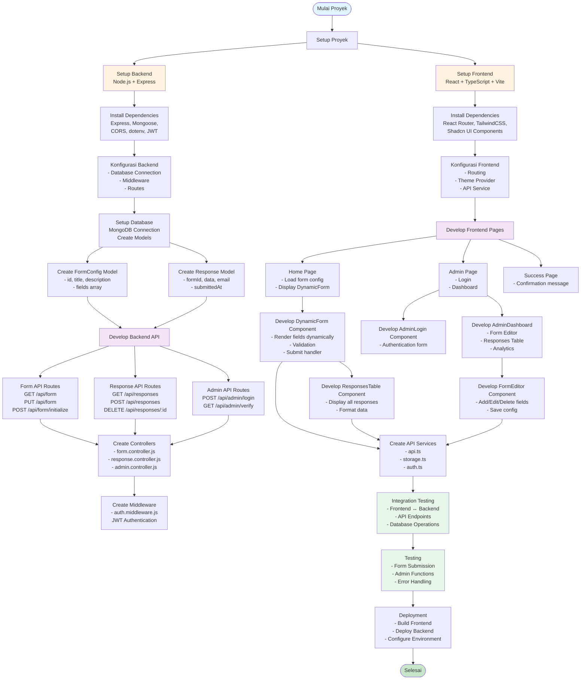
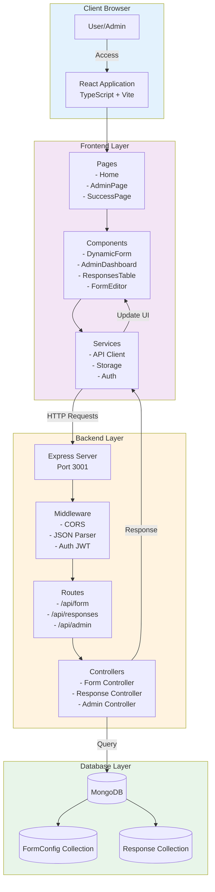
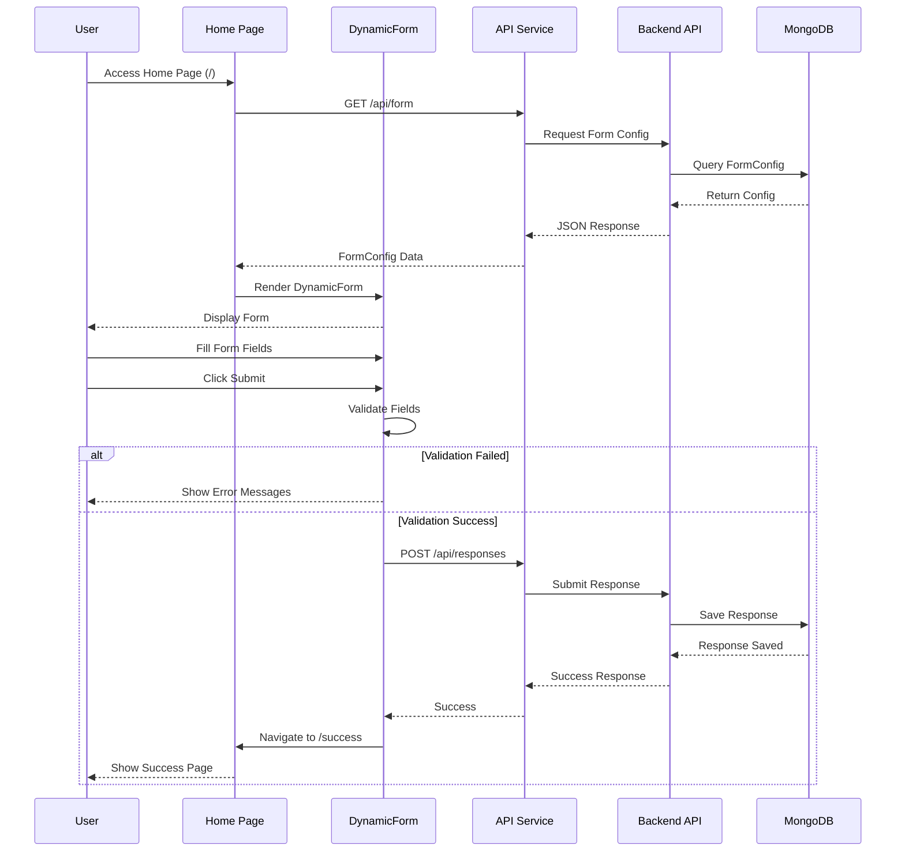
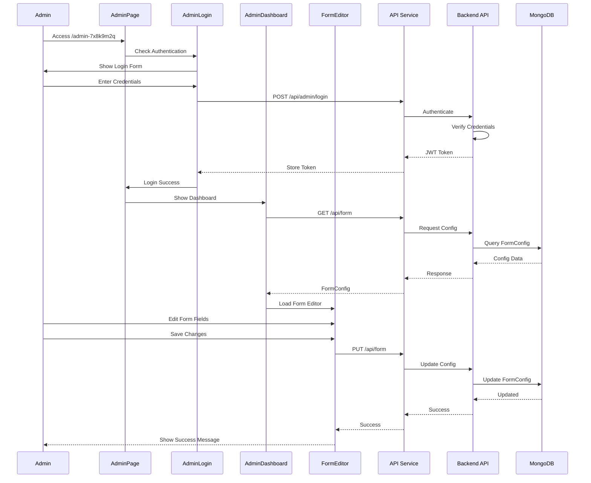
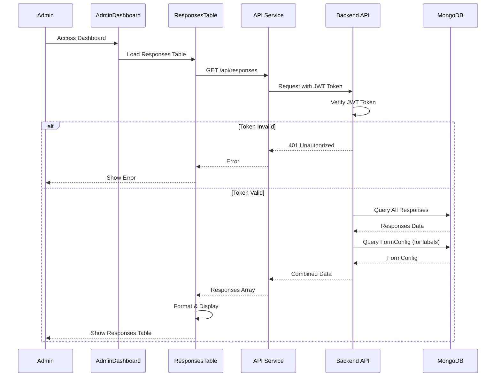
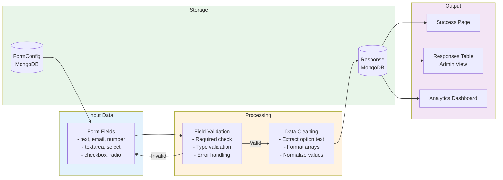
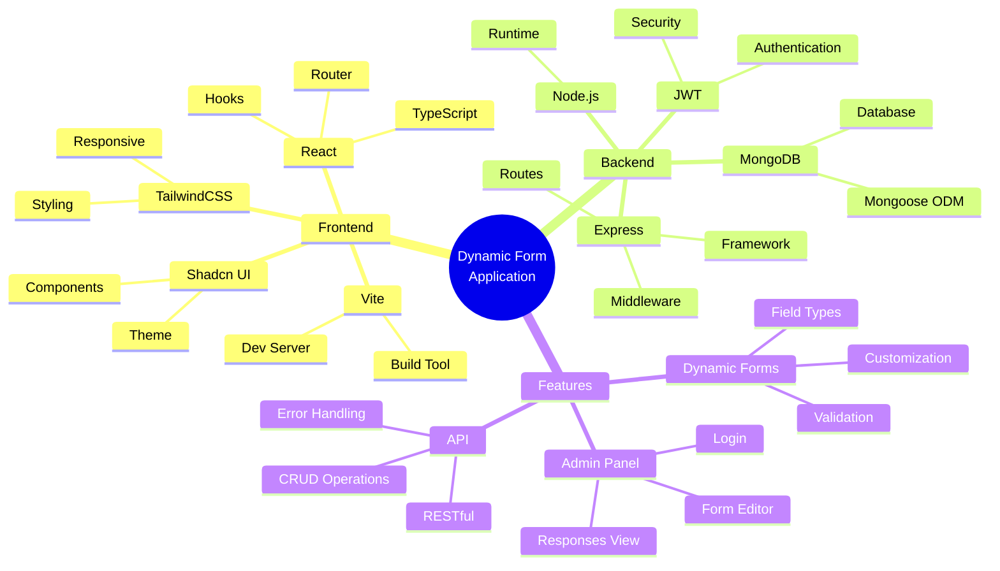

# Flowchart Alur Pembuatan Dynamic Form Application

## 1. Flowchart Proses Pengembangan

## 2. Flowchart Arsitektur Sistem

## 3. Flowchart Alur User - Form Submission

## 4. Flowchart Alur Admin - Form Management

## 5. Flowchart Alur Admin - View Responses

## 6. Flowchart Struktur Data Flow

## 7. Flowchart Teknologi Stack

## Penjelasan Singkat

### Tahapan Pengembangan:

1. **Setup Proyek**: Membuat struktur proyek frontend dan backend terpisah
2. **Database Setup**: Konfigurasi MongoDB dan pembuatan model data
3. **Backend Development**: 
   - API endpoints untuk form dan responses
   - Authentication middleware
   - Controllers untuk business logic
4. **Frontend Development**:
   - Pages untuk routing
   - Components untuk UI
   - Services untuk API communication
5. **Integration**: Menghubungkan frontend dan backend
6. **Testing & Deployment**: Testing dan deployment aplikasi

### Fitur Utama:

- **Dynamic Form**: Form yang dapat dikonfigurasi dengan berbagai tipe field
- **Admin Panel**: Panel admin untuk mengelola form dan melihat responses
- **Authentication**: JWT-based authentication untuk admin
- **Responsive Design**: UI yang responsif dengan TailwindCSS
- **Real-time Updates**: Update form config langsung mempengaruhi form user

